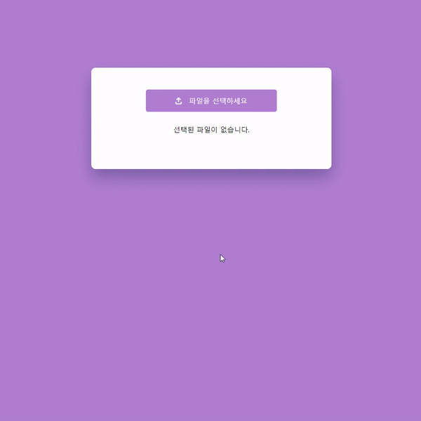

# 1. HTML

```
(conatiner) > input, label, num-of-files, ul
```

컨테이너  div 안에 input, albel, num-of-files label, ul dom이 같은 계층에 존재한다. label에 css 속성을 적용해서 button(으로 보이게) 커스텀할 것

# 2. CSS

# 3. JS

- `new` 생성자

  > 유사한 객체 여러 개를 쉽게 만들 수 있다. 객체 리터럴 문법으로 일일이 객체를 만드는 것보다 훨씬 간단하고 읽기 쉽다. => 재사용할 수 있는 객체 생성 코드를 구현하는 것!

  👍 '첫 글자가 대문자'인 함수는 `new`를 붙여 실행해야하는 것도 잊지 말기!

- `FileReader()`

  없어도 되는 코드이긴 한데,  

- toFixed 라는 속성은?

  => 속성이 아니고 `toFixed(n)` 메서드. 소수점 `n`번째 자리까지 가장 가까운 값으로 올림 혹은 버림한 후 문자형으로 반환한다. 메서드의 반환값이 문자열이므로, 소수부의 길이가 인수보다 작으면 끝에 0이 추가된다.

  `Number()`를 호출하면 숫자형으로 변환 가능하다.

  ```javascript
  let num = 12.34;
  alert( num.toFixed(5) ); // "12.34000", 소수부의 길이를 5로 만들기 위해 0이 추가
  ```

- 갑자기 궁금해져서 찾아봤는데, `&nbsp`는 dom tree로 어떻게 구성이 되는지 [Live Dom Viewer](http://software.hixie.ch/utilities/js/live-dom-viewer/#)를 활용해서 출력해봤다.

  => `&nbsp`는 <u>*자식 노드를 가질 수 없고, 문자열만 담을 수 있는* 텍스트(*text*)노드</u>에서 공백으로 표현되는 것을 확인할 수 있었다.

- 우선 `&nbsp`는 html 엔터티로

  [Entity/mdn](https://developer.mozilla.org/en-US/docs/Glossary/Entity)

  ```
  An HTML entity is a piece of text ("string") that begins with an ampersand (&) and ends with a semicolon (;).
  ```

  엠퍼서드 문자(`&`)로 시작해서 세미콜론(`;`)으로 끝난다.

  non-braking spaces(`nbsp`) 같은 보이지 않는 문자를 표시하는 데 자주 사용된다.

- 자바스크립트 노드 선택자로 dom 요소 가져오기

  [DOM 작업을 할 때 부모, 형제, 자식 노드 찾기](https://hianna.tistory.com/712)

  `insertAdjacentHTML()`을 사용하니까 먼저 dom이 렌더링 된 건지 두 개의 dom이 createElement되는 현상이 일어났다.(한 번에 두번...왜 그런지는 insertAdjacentHTML의 렌더링 순서에 있지 않을까 추측 중이다.)

  이미 렌더링된 dom의 값을 바꿔야 하므로 `textContent`를 수정하도록 구현했다. 파일사이즈가 1024KB가 넘으면 1MB로 표시하고 있는 요소가 마지막 자식 노드이므로 `lastChild`를 사용하여 text를 수정해주었다.

  👉 하나만 뜸! 문제해결!
